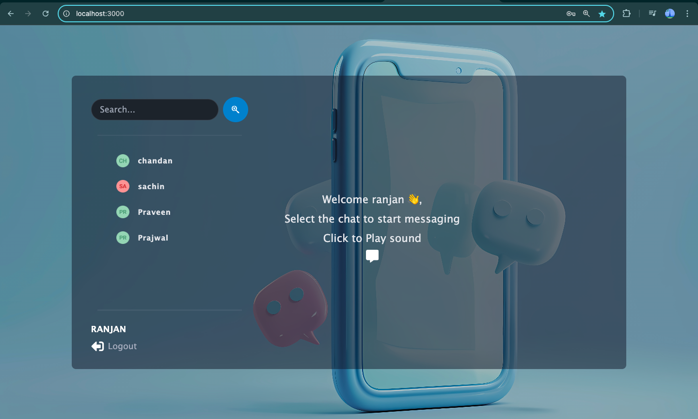
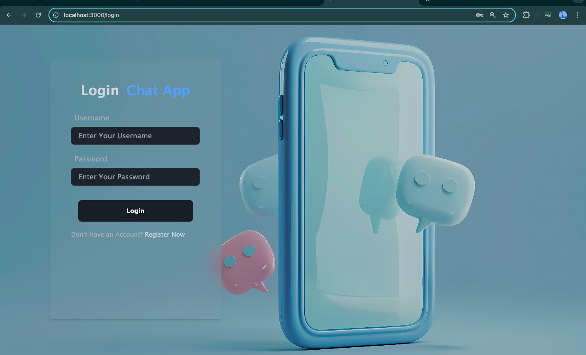

# MERN Chat App

A real-time chat application built using the **MERN stack** (MongoDB, Express, React, Node.js) and **Socket.IO** for real-time communication. This app allows users to register, log in, join chat rooms, and send messages in real-time.

## Table of Contents
- [Features](#features)
- [Tech Stack](#tech-stack)
- [Screenshots](#screenshots)
- [Installation](#installation)
- [Usage](#usage)
- [Environment Variables](#environment-variables)
- [Contributing](#contributing)
- [License](#license)

---

## Features

- Real-time messaging using **Socket.IO**.
- User authentication (Register, Login, JWT-based authentication).
- Display online users in the room.
- Notifications for new messages.
- Mobile-responsive design.
- MongoDB for storing user and chat data.
- Secure communication with **JWT** and **bcrypt** for password hashing.

---

## Tech Stack

### Frontend
- **React.js**: JavaScript library for building user interfaces.
- **Socket.IO-Client**: For real-time communication with the backend.
- **Axios**: For making HTTP requests to the backend API.
- **Tailwind CSS / SASS**: For styling.
- **Daisy UI**: For ui component library


### Backend
- **Node.js**: JavaScript runtime for server-side development.
- **Express.js**: Web framework for Node.js to build the API.
- **Socket.IO**: For real-time, bidirectional communication.
- **MongoDB & Mongoose**: MongoDB database and Mongoose for object data modeling.
- **JWT**: For user authentication and authorization.
- **bcrypt.js**: For hashing passwords.

---

## Screenshots




---

## Installation

To run this project locally, you'll need to have **Node.js**, **npm**, and **MongoDB** installed on your system.

1. **Clone the repository**:
   ```bash
   git clone https://github.com/your-username/mern-chat-app.git
   cd mern-chat-app
   ```

2. **Install the dependencies**:
   - Backend:
     ```bash
     cd server
     npm install
     ```
   - Frontend:
     ```bash
     cd client
     npm install
     ```

3. **Set up environment variables**: Create a `.env` file in the **server** directory with the following keys (see [Environment Variables](#environment-variables) for details).

4. **Start the development servers**:
   - Run the **backend**:
     ```bash
     npm run server
     ```
   - Run the **frontend**:
     ```bash
     cd frontend
     npm run dev
     ```

5. **Access the app**: Open your browser and go to `http://localhost:5173` for the frontend. The backend runs on `http://localhost:5000` by default.

---

## Usage

- Register a new account or log in with an existing one.
- Join chat rooms to start chatting with others in real time.
- View online users in the chat room and send messages instantly.


---

## Environment Variables

Create a `.env` file in the **server** directory with the following variables:

```plaintext
MONGO_URI=<Your MongoDB URI>
JWT_SECRET=<Your JWT Secret Key>
SOCKET_IO_ORIGIN=<Frontend Origin (e.g., http://localhost:5173)>
PORT=5000
```

- **MONGO_URI**: Your MongoDB connection string.
- **JWT_SECRET**: A secret key for signing and verifying JWT tokens.
- **SOCKET_IO_ORIGIN**: The origin (URL) from which Socket.IO will accept connections (e.g., `http://localhost:5173` during development).
- **PORT**: The port where your Node.js server will run (defaults to 5000).

---

## License

This project is licensed under the MIT License - see the [LICENSE](LICENSE) file for details.
